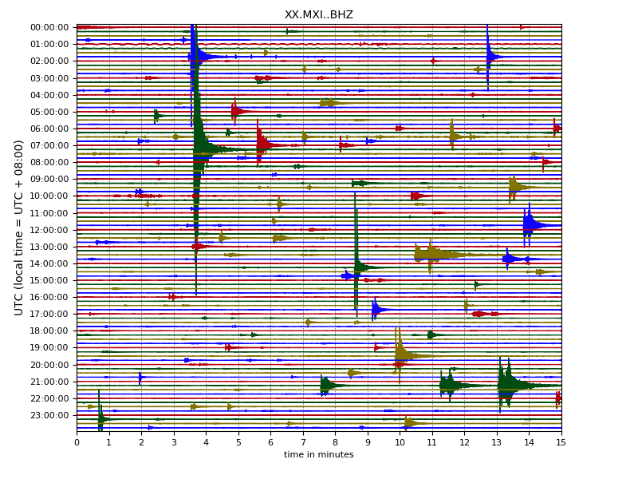
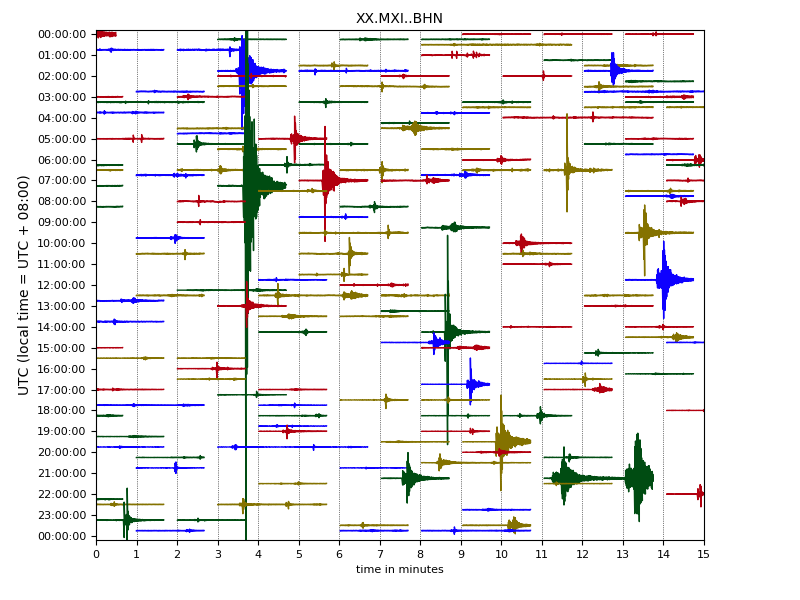
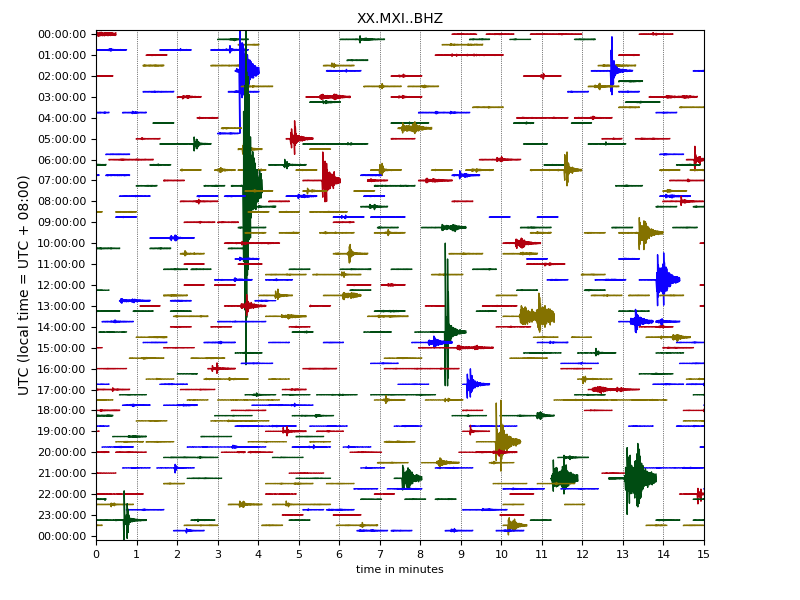
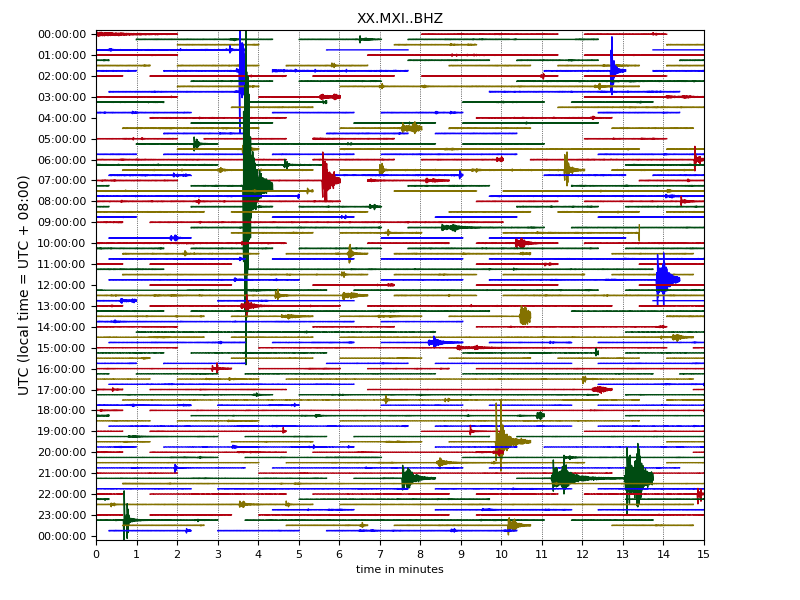
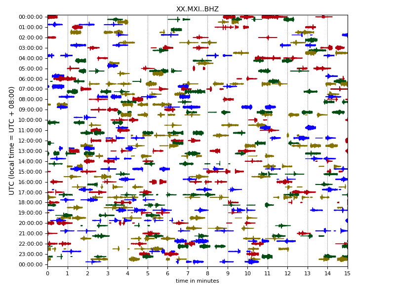

Using ConvNetQuake to train model for events classification based on wenchuan aftershocks
============= 

We use ConvNetQuake to train our own model for events classification based on the wenchuan aftershocks and use it to classify earthquakes from one day continous waveform(2008-07-25) of one station (MXI).

For  ConvNetQuake refer to:
Perol., T, M. Gharbi and M. Denolle. Convolutional Neural Network for Earthquake detection and location. [preprint arXiv:1702.02073](https://arxiv.org/abs/1702.02073), 2017.

The continious wavaform of MXI,2008-07-25

The hand picked events:

All CNN identified slices with prob>0.1,abosolute ampitude

We also use STA/LTA Algorithm (in obspy) for a comparison:

All CNN identified slices with prob>0.1,normalized ampitude

## Installation
* Download repository
* Install dependencies: `pip install -r requirements.txt`
* Add directory to python path: `./setpath.sh`

## Data of the continous waveform

Download the [data](https://pan.baidu.com/s/1N_gwRC95qwQHnfNX94cdgQ) (roughly 110 Mb) and symlink to data ln -s data Downloads/data
The continuous waveform data is in ./data

The `data` directory contains:
* `XX.MXI.2008207000000.mseed`: the continious waveform data 
* `dayplot.py`: a script to plot the continious waveform
* `merge_dayplot.py`: a merge script
* `XX.MXI_dayplot_[0-64800].png`: marked earthquakes of the day 
* `XX.MXI_dayplot_hand_picks.png`:hand picked events
## Train data
We provide a catalog ("MXI_catalog_for_train.txt") for train dataset,you can send a request to [CENC](http://news.ceic.ac.cn/index.html?time=1523511012) or [dmc](http://www.seisdmc.ac.cn/) and download the related waveform data.

## Trained model
We also privided a model which was trained on over 20000 earthquakes slices (30s) and over 60000 slices of noises (30s) 
The directory `trained_model` contains:
* `convnetquake`: trained model 

## Detecting events in continuous waveform data

### From mseed

./bin/predict_from_stream.py --stream_path data --checkpoint_dir trained_model/ConvNetQuake  --n_clusters 2 --window_size 30 --window_step 31 --output predict_MXI_one_day --plot --save_sac

It will generate a dir "predict_MXI_one_day",which contains:
 
* `viz`: the image of events,the name of the image contain its probility(prob) and its starttime,like "MXI_0.50053_2008-07-25T03_07_18.000000Z.png"
* `viz_not`: the image of noise,notice the  higher prob,the more likely it is an events,actually when the prob>0.1 there is a large chance it is an event. 
* `sac`: the slice data of viz

## Using overlapping windows
It proved using overlapping windows will get better results,however,the events will be identified more than once,you can choose the one with highest probility.To run,just uncomment "

#lists = np.arange(0,30,5)

" in predict_from_stream.py

## A hand-picked catalog for benchmark
We provide a hand-picked catalog(`MXI_20080725_hand_pick_PS.txt`) for users to compare with their own results.A qulified trained model should be able to find out all the earthquakes in this catalog.
